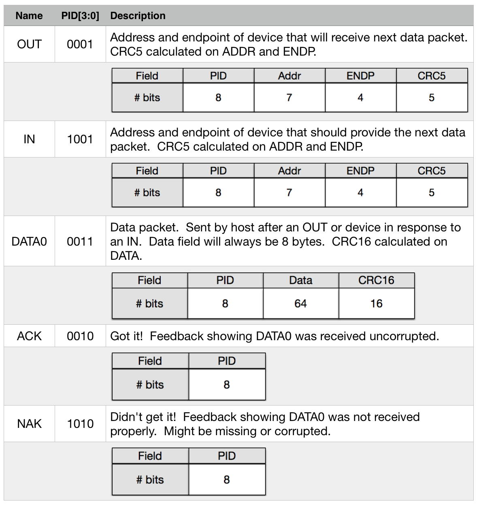
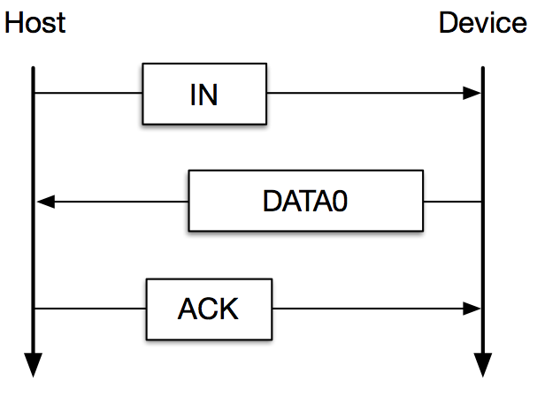
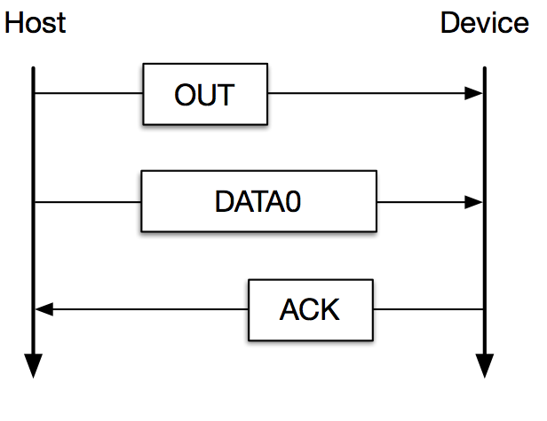
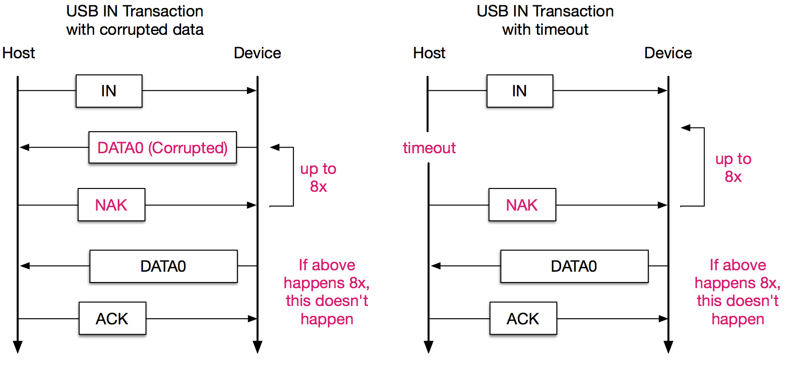
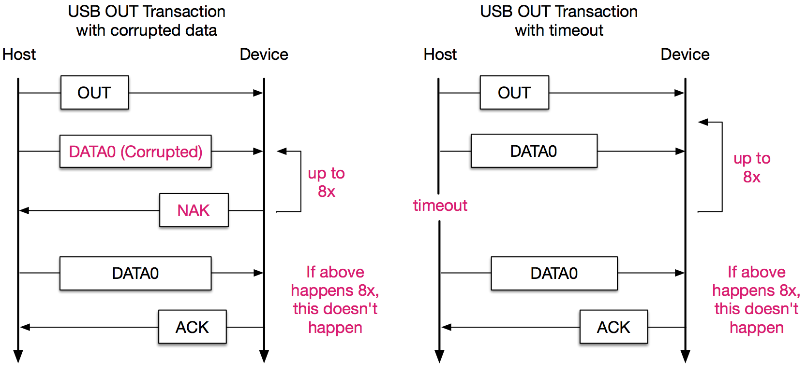
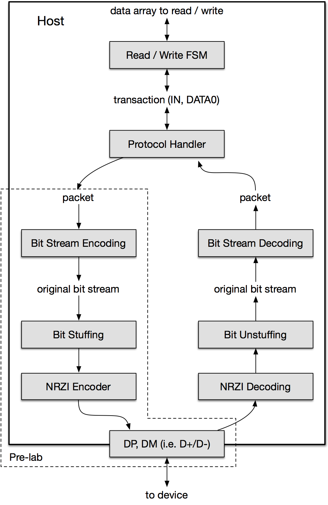
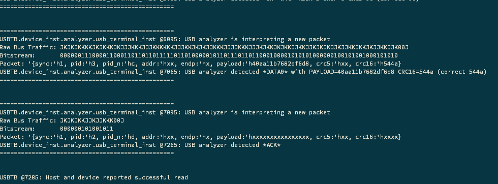

# USB Protocol Engine Project

18-341: Fall Semester of 2017

## Objective and Overview

The purpose of this project is to learn to work with larger, more real
interfaces.  You will implement a significant part of the USB 2.0 standard.  You
will develop skills to implement multiple hardware threads at multiple layers of
the protocol.  You will need to identify and design these layers and the signals
that synchronize their activity.

You will use the VCS simulator only, no FPGA board, for this project.

This is an **team** project.  See details in two sections from here.

## Schedule and Scoring

Project value | 100 points
--- | ---
Project start  | 22 Oct 2017
Part 1 due     |  1 Nov 2017 at 12:30pm
Project due    | 13 Nov 2017 at 12:30pm
Drop dead date | 14 Nov 2017 at 12:30pm

Remember!  You must have committed something by the drop-dead date!  *You must
attempt every project*.  Not uploading anything and not showing up to explain
what you’ve done is not attempting the project — see the syllabus for details.

## Teams!

Project 4 is to be accomplished in teams of 2.  You will be assigned a teammate.
The goal, of course, is to share the work and learn from each other.  As such,
you are expected to work together: communicate well, discuss your design, share
responsibilities throughout the project.  If you are having teammate issues,
please talk to course staff right away so we may help you to solve them.  Don't
wait until the end, at which time the staff is out of options and won't be able
to help much.

Grace days used will be charged to both partners of the team.  If you already
have used your grace day, but your partner hasn't, then your team needs to turn
your team's solution in on time.  Communicate with your partner right away about
your lack of an available grace day.

As a team, you should be using Git as a collaborative tool.  Your GitHub
Classroom repository is a team repository -- make sure you join the correct
team.  Then, communicate with your partner about workflow.  How do you intend to
collaborate?  Will you branch whenever you are doing work on a feature?  Will
you only merge when you have a working feature?  Figure this out ahead of time
with your partner.  As with any team collaboration, communication is key.  Talk
to your teammate about organization.  Talk to TAs or me for help.

The same ideas about academic integrity apply to this project, even though it is
a team project.  All work must be that of your own team.

Hints from others can be of great help, both to the hinter and the hintee.
Thus, discussions and hints about the assignment are encouraged.  However, the
project must be coded and written up as a team (you may not show, nor view, any
source code from other teams).  We may use automated tools to detect copying.

Use Piazza to ask questions or come visit us during office hours (or email for
an appointment at another time).  We want to see you succeed, but you have to
ask for help.

## Background

In this project you will design and simulate part of the Serial Interface Engine
(SIE) of a USB 2.0 Host.  You will not implement the entire standard — you can
start breathing again — and not everything will be exactly according to the USB
specification.

Your host will be connected to a single device — a thumb drive model (which we
will provide).  Your host will not have to do any of the configuration phases on
the thumb drive — it already knows about the drive's address, endpoint behavior,
etc.

Your host will read and write blocks of data from / to the thumb drive.  The
testbench that interacts with your host will mimic the operating system making
read and write requests.  Your host will then carry out the request by
controlling the USB to send and receive packets of type **OUT**, **IN**,
**DATA0**, **ACK** and **NAK**.

Your USB host will (hopefully) have several coordinated hardware threads to
handle all of the activity from the very lowest level (**NRZI**, bit stuffing,
**CRC5/CRC16** generation/checking, ...) through to higher-protocol level
handling (**ACK/NAK** generation, error processing, retries, timeout counters,
...)  For the rest of this document, I'm going to group these and call them the
bit-level and the protocol-level hardware threads.  You will need to design
these threads, as well as the interactions among them (i.e. the interface
protocols between them).

I mentioned errors and retries above.  How can there possibly be errors?  Recall
that we are providing the device model (the thumb drive), which has been
designed with some errors in it (and perhaps has some errors that we didn't
design in).

Lecture 16 covered (will cover) lots of USB basics.  I will recreate some of the
ideas in the next couple of pages, but please refer to your notes from that
lecture to understand lots of the "why" behind these details.

## J's, K's, D+, D-, SEO

**J** and **K** are the states associated with a logic one or zero.  **J** means
the voltage on **D+** is greater than the voltage on **D-**.  **K** is the
opposite.

The wires on the USB bus are named `DP` and `DM` (for **D+** and **D-**, which
aren't valid SystemVerilog signal names).  They have `tri0` net types to allow
them to be pulled down.  Driving the bus wires should be done with tri-state
drivers.

**SYNC** (i.e. start of packet) is `b0000_0001`.  This value will be passed
into the **NRZI** module to create lots of edges on the signal wires.

**EOP** (i.e. end of packet) is **XXJ**, where **X** means single-ended zero
(**SE0**).  In an **SE0**, both of the **D** lines are zero (`DP == 0`,
`DM == 0`).

## USB Packets

There are 15 different packet types, but you will only implement 5 of them, as
specified in this table:



## Transactions

In USB-speak, there are **IN** *packets* as described above (officially, they're
Token packets with a PID saying IN, but we’ll just call them **IN** packets).
There are also USB **IN** *transactions*.  A USB **IN** *transaction* starts
with the host sending an **IN** *packet* to a device, waiting for the device to
send a **DATA0** *packet*, and then the host sending an ACK *packet*.  This
*transaction*, built out of a sequence of packets, is shown in this process flow
diagram.  (Okay, I'm sick of italicizing stuff, so I'll stop for a while).



Similarly, there are **OUT** packets as described above and USB **OUT**
transactions.  An **OUT** transaction starts with the host sending an **OUT**
packet to the device.  The device then knows to expect a **DATA0** packet.  When
the **DATA0** packet is sent, the device sends an **ACK** packet to the host.
This transaction, built out of a sequence of packets, is shown in this process
flow diagram.



Your host will be requested by the testbench to do **READs** and **WRITEs** with
the thumb drive.  To do a **READ** operation (a term we made up), the USB host
would do an **OUT** transaction to send a memory address to the device (it would
be in the **DATA0** packet).  Note that the memory address being sent is the
address of memory in the thumb drive, not the USB ADDR of the thumb drive!  It
would then do an IN transaction to get the device to send it the data read from
the thumb drive memory.  In a WRITE operation (something else we made up), the
USB host would do an **OUT** transaction to send a memory address -- again, not
the USB ADDR -- to the device (it would be in the **DATA0** packet).  It then
would do another OUT transaction to send the data to be written in the thumb
drive's memory.  In all cases, the **DATA0** packet will send 8 bytes.  When
sending the memory address, the address is in the first two bytes of the
**DATA0** packet's DATA field with the remaining 6 bytes being zero.  Remember,
the DATA field is actually transmitted LSB first.

The above diagrams assume that everything was correct, i.e., there were no CRC
errors and no timeouts due to someone missing a packet.  Below are two modified
process flow diagrams for IN transactions where errors occur.  On the left,
corrupted data is sent by the device — it may be caused by noise on the line,
etc.  The host responds with a **NAK** and the device tries again, up to
8 times.  Hopefully, that data finally gets through and the host sends an ACK.
However, if it tries and fails 8 times, the whole transaction is cancelled.  On
the right, nothing is received.  After 255 clock periods, the host times out and
sends a **NAK**.  At this point, the device should send another **DATA0**
packet.  If the timeout occurs 8 times, then the whole transaction is cancelled.



A similar thing happens with **OUT** transactions and data either being corrupted
or there being a timeout.  The diagrams are similar and won't be explained.



At the transaction layer, these are the only types of errors that you have to
consider.  Notice though that you will need a protocol FSM-D to keep track of
these possible situations.  This Protocol FSM-D should embody the above flow
diagrams.  Don't get caught NAKed.

## NRZI, Bit stuffing and CRCs

The different fields within packets are **SYNC**, **PID**, **ADDR**, **ENDP**,
**DATA**, **CRC5/CRC16** and **EOP**.  However, not all packets contain all of
those fields.  See the table in the USB Packets section.

USB's **NRZI** encoding scheme is different than commonly employed.  In USB, the
output (i.e. encoded bit) changes whenever the input is a zero and stays the
same when the input is a one.  See the lecture notes.  The first bit of the
**NRZI** should be output as if the previous bit sent was a **J**.  All fields
types are sent through **NRZI** except the **EOP** (what's the "inverted" of
**SE0**?  I don't want to think about it.)  For instance, when the **SYNC**
field (`b0000_0001`) is passed through **NRZI**, the output will be
**KJKJ\_KJKK**.

In order to bit-stuff the bit stream, a zero will be inserted after six
consecutive ones.  All fields are stuffed except for **SYNC**, **PID** and
**EOP**.  Bit stuffing starts by counting the first bit after the **PID** and
continues through the end of the **CRC** field.  This isn't exactly how the
standard does it, but it is how we will do it.

Any **DATA0** packets will use **CRC16**.  All other packets in your project use
**CRC5**.  The associated polynomials and residues are shown in this table.  You
do remember the difference between *remainder* and *residue*, right?

| Format | Polynomial | Residue |
|--------|------------|---------|
| CRC5   | X^5 + X^2 + 1 | `b01100` |
| CRC16  | X^16 + X^15 + X^2 + 1 | `h800D` |

## Finally, the Whole Enchilada

The layered organization of the FSM-Ds for your host is shown in this figure.
The boxes are the FSM-Ds and the unboxed labels represent data (e.g., the array
to read/write, the original bit stream, or a packet, etc.).  Everything below
the bit stream encoding or decoding box is serial; everything above has
registers or arrays with data in them.  For instance, the Protocol Handler won't
do anything until it sees that the whole packet has arrived.  And it will do
something different depending on whether the packet was correct or not.



Think of each of these FSM-Ds as doing a piece of the work — providing a service
— and handing it to the next.  Thus there are some signal and data lines between
each of the FSM-Ds that define their inter-FSM-D protocol.  These signals are
not shown in the figure — you need to define them based on your design.

**Read/Write FSM:**  The role of the read/write FSM is to receive the task calls
from the testbench (see below).  The calls will either be for a read or write of
the memory.  The FSM-D creates a sequence of **IN** and/or **OUT** transactions
to implement the request.  These are individually passed to the Protocol
Handler.

**Protocol Handler:**  The role of the protocol thread is to turn an **IN** or
**OUT** transaction request given to it by the Read/Write FSM into a series of
packets to implement the transaction.  It also receives packets from the device.
Thus it handles all the **ACKs**, **NAKs**, retries and time outs.  Consider the
bit stream decoder again, it might have received a packet, but found that the
**CRC** was wrong.  The Protocol FSM, seeing such an indication, will then know
to send a **NAK**.

For the serial parts of the system, the serial bits pass through the FSM-Ds
(encoding, bit stuffing, **NRZI**) — they're each Mealy machines. Don't
calculate the **CRC** on the whole packet, and then stuff bits as needed, and
then calculate the **NRZI**, and then begin sending out the bits.  Rather, it's
one bit stream going through some Mealy machines.  The other way sounds like
software — don't go there!

A way to think about the project is that your testbench will call a task (e.g.,
**readData**).  The task will set up registers that will start the Read/Write
FSM doing its thing (in this case a read of some memory location).  The
Read/Write FSM will tell the Protocol Handler to start doing a transaction (like
**IN** or **OUT**).  The Protocol Handler will send a packet and make sure the
packet is received (handling the error conditions, **ACKs**, **NAKs**, etc).
When the data read has been returned in a **DATA0** packet, the Protocol Handler
will tell the Read/Write FSM of success (or failure).  The testbench task will
return with the value of success (and the data if it was a read) and the
testbench can decide what to do next.

Your FSM-Ds should be written in the explicit style.  They should be
synthesizable although we will not synthesize them.

You need to define the protocols — the signaling bits and data, and their
relation to each other — at each of the FSM-D boundaries that you have. (This is
part of the prelab.)  BTW, you don't need to stick to this exact figure when
organizing your implementation.  But don't think you'll be able to do this as
just one biggie-sized FSM-D!  The layered view is quite useful in constructing
(for transmitting) or deconstructing bit streams (for receiving) — the FSM-D
partitioning should follow from it. Simpler coordinated FSM-Ds are the way to
go.

The code sample to hand in for prelab is shown in the dashed line.  Once you see
that it's working with our prelab-testbench, then you can continue building the
other parts of your USB.

## The Device

The USB address of the thumb drive device, used in **ADDR** fields, is **5**.
Don't confuse this with the address of the memory's data that is being read or
written.

To send the memory address to be used when reading or writing memory, send an
**OUT** transaction to **ADDR 5**, **ENDP 4**.  The **DATA0** packet that is
part of the **OUT** transaction holds 6 bytes of zero and then the 2-byte memory
address.

After the memory address has been sent:

* To read from that address, start an **IN** transaction, with the **IN** packet
  sent to **ADDR 5**, **ENDP 8**.

* To write to that address, start an **OUT** transaction, with the **OUT**
  packet sent to **ADDR 5**, **ENDP 8**.

The **DATA0** packet that is part of the **IN** or **OUT** transaction will
contain the data to be read or written.

Obviously, the **IN** or **OUT** transaction will also need **ACKs**, **NAKs**,
timers, retries, etc.

## A SystemVerilog Thing

We will use the SystemVerilog **interface** construct in this project, although
minimally (See SVBook 6.5.1).  We have instantiated the interface for you in the
**top.sv** file.  Your host module already has it as a port (boy, are we nice
guys…).  The signal lines themselves are of type **tri0**, so they are pulled
down to **0** when nothing is driving them.  Make sure you use tristate drivers.

```systemverilog
interface USBWires; // this defines the interface
  tri0 DP;  // The D+ wire
  tri0 DM;  // The D- wire
endinterface

//then, in another galaxy, far, far away…

USBWires wires(); // this instantiates the interface with instance name “wires”

assign wires.DP = (enable) ? foo : 1'bz; // A tristate driver
assign wires.DM = (enable) ? bar : 1'bz; // Another tristate driver

assign yourVar1 = wires.DP; // getting access to DP and DM
assign yourVar2 = wires.DM;
```

## Faking the OS

Your testbench, pretending to be an OS, will call some tasks, which reside in
your **USBHost**, to set up memory accesses.  So that the TA testbench can
initiate reads and writes using these same tasks, you must stick to these task
headers.  The status returned (success) indicates if the transaction completed
successfully, as opposed to there being 8x bad packets or an 8x timeout.  We’ll
provide several encrypted thumb drives for you corresponding to various levels
of the protocol.  They will print information telling you what they received
and/or what they're sending back to you.  We will provide some with typical
errors.

```systemverilog
task readData
// Host sends mempage to thumb drive using a READ (OUT->DATA0->OUT->DATA0)
// transaction, and then receives data from it. This task should return both the
// data and the transaction status, successful or unsuccessful, to the caller.
( input logic [15:0] mempage, // Page to write
  output logic [63:0] data, // Vector of bytes to write
  output logic success);

  data = 64'h0;
  success = 1'b0;

endtask : readData

task writeData
// Host sends mempage to thumb drive using a WRITE (OUT->DATA0->IN->DATA0)
// transaction, and then sends data to it. This task should return the
// transaction status, successful or unsuccessful, to the caller.
( input logic [15:0] mempage, // Page to write
  input logic [63:0] data, // Vector of bytes to write
  output logic success);

  success = 1'b0;

endtask : writeData
```

How will these tasks work?  Given the task header shown above, your testbench
could invoke them to perform a read.  It would pass in the address to be read
from and, when it returns, check the output parameters to see if the data was
correct and if it was read successfully.  Perhaps like so:

```systemverilog
// in your testbench
logic [15:0] address;
logic [63:0] dataRead;
logic        did_it_right;

initial begin
  // other stuff, setup, tests here
  . . .

  readData(.mempage(address),
           .data(dataRead),
           .success(did_it_right));

  if (did_it_right == 1'b1) begin
    $display("Cool!");
    // other checking
  end

  . . . // other stuff
end
```

Thus, your testbench can easily create **IN** and **OUT** transactions to read
and write data and check if you get the right data back.

What's in the task **readData**?  It might look something like this (your
mileage may vary):

```systemverilog
task readData
  (input  logic [15:0] mempage,  //Page to read (address to read)
  output logic [63:0] data,     //the 8 bytes read, return to tb
  output logic        success); //1'b1 if successful, 1'b0 if not

  FSMmempage <= mempage;
  startFSM   <= 1'b1;

  wait (read_write_FSM_done); // this variable should be set
                              // synchronously
  startFSM   <= 1'b0;
  dataRead   <= valueRead;
  success    <= isValueReadCorrect;
endtask : readData
```

This task would be inside the module that is your FSM-D.  The variables
**FSMmempage**, **startFSM**, **valueRead**, and **isValueReadCorrect** are
meant to be variables used by the Read/Write FSM (they would be defined outside
the task but inside the module — other organizations can work too).  You may
have different variable names.  BTW, **startFSM** is a signal to the FSM to
start doing its thing; set it back to zero so it doesn'' do it twice!  The point
is that you call this task, it sets some variables, the Read/Write FSM sees the
variables and starts doing its thing, then the tasks waits for the read/write
FSM to be done, then it returns the values to the testbench.  Essentially, the
task (an implicit FSM) and your Read/Write FSM (an explicit FSM) are handshaking
on reading and writing the memory.

Of course, you will probably want to write many smaller testbenches along the
way to check smaller functionality (e.g., the **CRC**).

## Our Testbenches

We have developed several testbenches, all of which are exposed in **USBTB.sv**,
similar to Router lab.

```
////
//// The USB SIE Testbench
////
////   clock         (input)  - The clock
////   reset_n       (input)  - Asynchronous reset
////   wires         (iface)  - USB {DP DM} tri-state wires, pulled down to 0
////   debug_pkt_ext ()       - Exposed USB packet struct from the bus analyzer
////                            that reflects captured traffic in real-time.
////                            See field definitons in "usbPkg.pkg".
////
//// Testbench Usage
////   1. Compile your code using the Makefile supplied "make {full/clean}"
////   2. Run the testbench with one or more of the following runtime arguments
////      ./simv {-gui} {+{plusargs ... }} {+vcs+finish+{d}} {+VERBOSE={1,2,3}}
////      e.g. ./simv -gui +SIMPLE +EDGE +vcs+finish+100000 +VERBOSE=3
////
////     - +PRELAB:  prelab checkoff; device accepts a valid OUT packet with
////                 ENDP=`DATA_ENDP and ADDR=`DEVICE_ADDR
////     - +SIMPLE:  TB directs host to write then read one random address
////     - +EDGE:    TB directs host to write then read carefully chosen
////                 addresses and data to cause CRC and bitstuffing edge-
////                 cases
////     - +STRESS:  TB directs host to write then read 100 random addresses
////     - +CORRUPT: TB directs host to read 10 random addresses, but the
////                 device will send between 1 and 7 corrupt versions of the
////                 DATA0 packet each time; YOU WILL SEE AN ASSERTION FAILURE
////     - +TIMEOUT: TB directs host to read 10 random addresses, but the device
////                 will timeout between 1 and 7 times
////     - +NAK:     TB directs host to write 10 random addresses, but the
////                 device will send 1 to 3 bogus NAKs during each OUT
////                 transaction; YOU WILL SEE AN ASSERTION FAILURE
////     - +ABORT:   TB directs host to write random data twice, but the device
////                 will error 8 times and throw out both transactions; YOU
////                 WILL SEE AN ASSERTION FAILURE
////
////   !NOTE AGAIN!: concurrent assertions are statements of truth, so YOU WILL
////                 see some very specific failures in +CORRUPT +NAK and +ABORT
////
```

After you "make" the executable above, type **./simv** to execute it with the
proper flags to enable the testbenches.

Here is what a successful test output should look like:



Only the prelab will respond with a message, such as the following, but it
should be clear from the output whether your host passes or fails:

  > {stuff} @{time}: Device saw correct prelab packet. Prelab successful.

If you experience assertion failures, the test hangs, or the tesbench quits
before it is done, your design may need some attention.

## For You

In the repo, you will find the following files:

* **Makefile** — use this to simulate your USBHost.sv with one of the various
  testbenches (listed above).

* **USBDevice.svp** — The encrypted thumb drive.

* **USBHost.sv** — Your host.  Do your work here.

* **USB.svh** — Some definitions that get used in device (and which you can use
  in your host).

* **USBPkg.pkg** — We haven't talked about packages yet, but this contains
  typdefs and enumerations for structures from the USB standard. Importing this
  has been done for you.

* **USBTB.sv** — Our testbench, feel free to take a look!

## For Credit

Turn in these parts at the times listed.  Of course, submission is done by
tagging (yes, using a git tag) some commit with **Prelab** and **Final**. These
parts include:

* A prelab report and upload file.  The report will be a diagram of the FSMDs
  and their interconnections.  What are the handshake signals that are used
  between them?  What registered values are passed between them.  Upload code
  that will send an **OUT** packet with **ADDR=5** and **ENDP=4**.  The packet
  should have **SYNC** and **EOP** too.  It should drive the wires in the
  interface in USBHost.sv.  We’ll receive it and check the packet with the bus
  analyzer.

* A final, short write-up explaining your system's organization.  Alter the
  pre-lab diagram as necessary; explain the signaling variables between the
  FSMDs.  Show the state transition diagrams for the non-testbench parts of the
  system.  Also, include a discussion of which teammate did which parts of the
  project.

* Your SystemVerilog modules "appropriately" written.  e.g., clean writing style
  and correct use of SV language semantics.  The only connections between your
  **USBHost** and our **USBDevice** are on the **USBWires** interface, the
  common `clock` and `reset_n` These models should not use any global variables.
  (Common clock? That's right, we're not implementing PLLs.)

Given the above files, we will do the following:

* Run the testbenches. We will run our script file with our testbench with your
  design automatically. That's why it's important to conform to the bus signal,
  task, and module names and file organization. This will keep your personal
  demo shorter.

* Ask you some questions. Come early prepared to start. **THIS PROJECT IS HARD**

If you can't get all of this to work, please note from the grading sheet that
we’ll give partial credit for seeing certain parts of this working (these parts
tie into the “whole enchilada diagram” above). Making sure that your partial
solution shows evidence of these parts working as this will help us give you
partial credit for what you did. Of course, if it's all working you don't need
to show all these intermediate points.

Don't try to write the whole thing and then test it. Write and test parts, and
keep adding. This will also help with partial credit.

## Demos and Lateness

Same as in previous projects, you will demo outside of class times on or near
the due date.

* **Grace Day:**  You may use your grace day to turn in the solution up
  to 24 hours late.  If you do not intend to use a grace day (or have already
  used yours), make sure you have something committed and pushed at the
  deadline to avoid getting a zero on this project.
